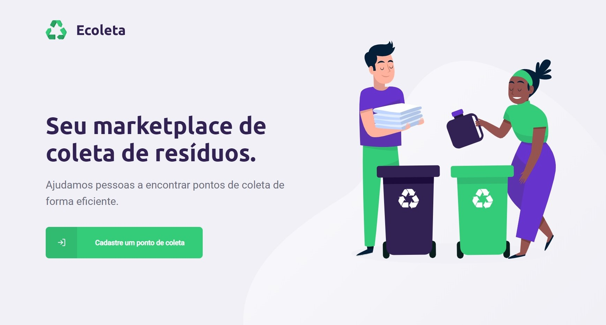

# NextLevelWeek
<h1 align="center">
  
  </h1>
  
  <h4 align="center"> 
	 Connecting people to help Ecologia :muscle:
  </h4>
  
  

  
  
  
  
  

  <h1 align="center">
  
  </h1>
  
  
## :rocket: Technologies

- [Node.js](https://nodejs.org/en/) 
- [React](https://reactjs.org)
- [React Native](https://facebook.github.io/react-native/)
- [TypeScript](https://www.typescriptlang.org/)
- [Expo](https://expo.io/)

## :computer: Project 

Ecoleta is a project that connects stores with people who want to discard
recyclable waste. Stores register on the website and people visit them
through the App and, if you can help the ecosystem, locate or local
suitable for disposing of your waste. 

## :round_pushpin: How to user?

To clone and run this application, you'll need [Git](https://git-scm.com), [Node.js][nodejs] + [Expo][Expo] installed on your computer.

  

## :heavy_check_mark: Tests

Run the following commands:
- `npm run dev`;
- `expo start`;
- `npm start`;

## :question: How to contribute? 

- Make a fork;
- Create a branck with your feature: `git checkout -b my-feature`;
- Commit changes: `git commit -m 'feat: My new feature'`;
- Make a push to your branch: `git push origin my-feature`.

After merging your receipt request to done, you can delete a branch from yours.

## :memo: License

This project is under the MIT license. See the [LICENSE](https://github.com/Tiago-26/NextLevelWeek/blob/master/LICENSE) for details.

---

Made by: Tiago Alves [:boy:](https://www.linkedin.com/in/tiago-alves-melo-57114b1a6/)

